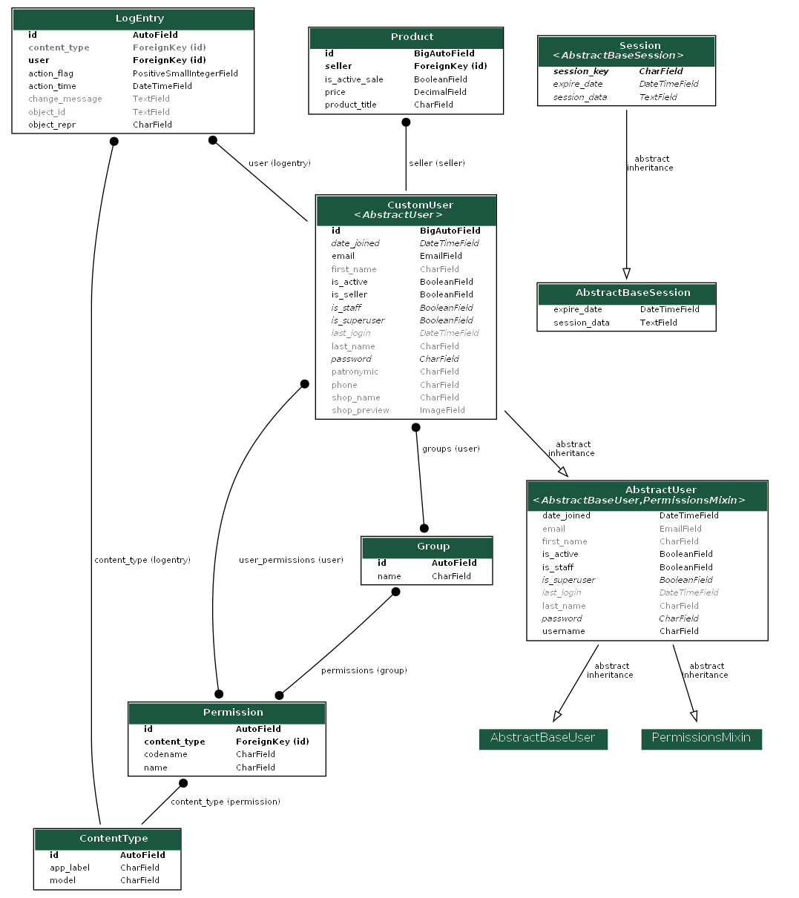
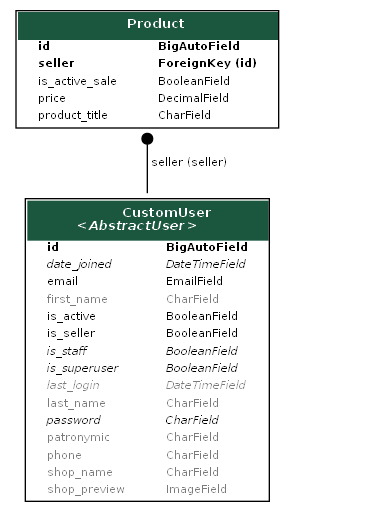

# marketplace-API-template

Данное проект предназначен для реализации HTTP запросов и направлен на использование в маркетплейсах.

## Стек технологий:
- python 
- django
- djangorestframework
- python-dotenv
- psycopg2-binary
- djangorestframework-simplejwt
- drf-yasg
- coverage
- flake8
- django-extensions
- ipython
- django-filter
- pillow
- pyparsing
- pydot
- django-cors-headers


## Установка
Прежде чем начать использовать Marketplace API, убедитесь, что у вас установлен 
интерпретатор Python c версией не ниже 3.9:

Клонируйте репозиторий с помощью следующей команды:
   ```bash
   git clone git@github.com:Abramov0Alexandr/marketplace-API-template.git
   ```

Перейдите в директорию проекта:
   ```bash
   cd marketplace-API-template
   ```

Активируйте виртуальное окружение Poetry и установите зависимости:

   ```bash
   poetry init
   ```

   ```bash
   poetry shell
   ```

   ```bash
   poetry install
   ```

Создайте и примените миграции для базы данных:

   ```bash
   python manage.py migrate
   ```


Запустите сервер:
   ```bash
   python manage.py runserver
   ```

Теперь приложение доступно по адресу http://localhost:8000/.


## Регистрация
Для регистрации в сервисе необходимо отправить POST-запрос на эндпоинт users/create/. 
В зависимости от выбора регистрации пользователя необходимо передать следующие данные:

  1. Регистрация как обычный пользователь:
     - first_name: Ваше имя.
     - last_name: Ваша фамилия.
     - patronymic (необязательно): Ваше отчество (если есть).
     - email: Ваша почта.
     - password: Пароль для входа.
     - password_confirmation: Подтверждение пароля.
     - is_seller: Оставьте поле пустым или укажите false, чтобы зарегистрироваться как обычный пользователь.


  2. Регистрация в качестве продавца:
     - email: Ваша почта. 
     - shop_name: Название магазина. 
     - password: Пароль для входа.
     - password_confirmation: Подтверждение пароля.
     - is_seller: Укажите true, чтобы зарегистрироваться как продавец.


## Возможности API
Наш проект предоставляет следующие возможности через API:

  1. Идентификация и авторизация:
     - Регистрация новых пользователей (как обычных, так и продавцов).
     - Авторизация пользователей.
     - Получение JWT-токенов для аутентификации.


  2. Создание и управление товарами:
     - Создание нового товара.
     - Просмотр списка товаров.
     - Просмотр детальной информации о товаре.
     - Редактирование и удаление товаров (доступно только продавцам).
     - Снятие или вывод товара в продажу (доступно только продавцам).


## Схемы моделей и их взаимосвязей
Полная схема моделей



Схема кастомных моделей



## Документация
Документацию к API вы можете найти перейдя по следующим ссылкам:<br>
http://127.0.0.1:8000/swagger/ <br>
http://127.0.0.1:8000/redoc/

## Тестирование
Для запуска тестов используйте следующую команду:

   ```bash
   python manage.py test
   ```

## Лицензия
Marketplace API распространяется по [MIT License](https://opensource.org/licenses/MIT).

## Контакты

Спасибо за использование Marketplace API! Если у вас есть какие-либо вопросы или предложения, не стесняйтесь обращаться к нам.

Автор: [Alexandr Abramov <https://github.com/Abramov0Alexandr>]

Связь: [alexandr.abramovv@gmail.com]https://github.com/Abramov0Alexandr)

GitHub: [https://github.com/Abramov0Alexandr]